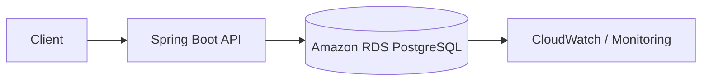

# Lab 2: Spring Boot + RDS PostgreSQL

This lab demonstrates how to configure a Spring Boot application to connect to an Amazon RDS PostgreSQL database, manage credentials securely, and follow a production-oriented database deployment pattern.

## What we are building

A Spring Boot API that stores and reads employee records from a PostgreSQL database running on Amazon RDS.

## Why this matters for Java developers

Most enterprise Java applications depend on relational databases. This lab introduces the patterns Java teams actually use in production:

- Spring Data JPA
- connection pooling
- database credentials management
- private network access
- schema initialization and migration patterns

## AWS services used

- RDS
- VPC
- Subnets
- Security Groups
- Secrets Manager or IAM-based credentials
- CloudWatch

## Architecture



## Prerequisites

- AWS account
- AWS CLI configured
- Java 21+
- Maven
- a VPC and subnet strategy for database access

## Project structure

```text
rds-postgresql/
├── README.md
├── app/
│   ├── pom.xml
│   └── src/
├── terraform/
│   └── main.tf
├── scripts/
│   ├── deploy.sh
│   └── destroy.sh
└── docker/
    └── Dockerfile
```

## Step-by-step implementation

### 1. Create the database

Use RDS PostgreSQL with:

- public access disabled if possible
- private subnet placement
- a security group allowing app-to-database traffic only
- automated backups enabled

### 2. Configure the Spring Boot database settings

Example `application.properties`:

```properties
spring.datasource.url=jdbc:postgresql://<db-host>:5432/appdb
spring.datasource.username=appuser
spring.datasource.password=${DB_PASSWORD}
spring.datasource.driver-class-name=org.postgresql.Driver
spring.jpa.hibernate.ddl-auto=update
spring.jpa.show-sql=false
spring.jpa.properties.hibernate.dialect=org.hibernate.dialect.PostgreSQLDialect
```

### 3. Add the PostgreSQL dependency

```xml
<dependency>
    <groupId>org.postgresql</groupId>
    <artifactId>postgresql</artifactId>
    <scope>runtime</scope>
</dependency>

<dependency>
    <groupId>org.springframework.boot</groupId>
    <artifactId>spring-boot-starter-data-jpa</artifactId>
</dependency>
```

### 4. Create the entity

```java
@Entity
@Table(name = "employees")
public class Employee {
    @Id
    @GeneratedValue(strategy = GenerationType.IDENTITY)
    private Long id;

    @Column(nullable = false)
    private String name;

    @Column(nullable = false)
    private String role;
}
```

### 5. Add the repository and controller

```java
public interface EmployeeRepository extends JpaRepository<Employee, Long> {}
```

```java
@RestController
@RequestMapping("/employees")
public class EmployeeController {
    private final EmployeeRepository repository;

    public EmployeeController(EmployeeRepository repository) {
        this.repository = repository;
    }

    @GetMapping
    public List<Employee> findAll() {
        return repository.findAll();
    }

    @PostMapping
    public Employee create(@RequestBody Employee employee) {
        return repository.save(employee);
    }
}
```

## Deployment

1. Create the RDS database instance
2. Configure VPC security groups
3. Add app environment variables
4. Start the Spring Boot service
5. Validate API endpoints

## Testing

```bash
curl http://localhost:8080/employees
```

## Security

- use IAM DB authentication or Secrets Manager when appropriate
- keep database in private subnets
- avoid public access for production
- limit security group access to application subnet only

## Monitoring

- RDS CloudWatch metrics
- DB connection count
- CPU utilization
- free storage
- query latency

## Cost considerations

- use a small instance for lab work
- enable backups only as needed
- stop or delete the RDS instance when finished

## Production improvements

- enable Multi-AZ
- use read replicas for heavy reads
- configure connection pool sizing
- add migration tooling such as Flyway or Liquibase
- add application-level observability and alerting

## Common mistakes

- exposing the database to the internet
- setting overly permissive security groups
- storing plaintext credentials in configuration files
- ignoring connection pool sizing and DB performance tuning

## Cleanup

```bash
aws rds delete-db-instance --db-instance-identifier <db-name> --skip-final-snapshot
```

## Related labs

- Spring Boot + S3 file upload
- Spring Boot + SQS order processing
- Deploy Spring Boot on EC2
