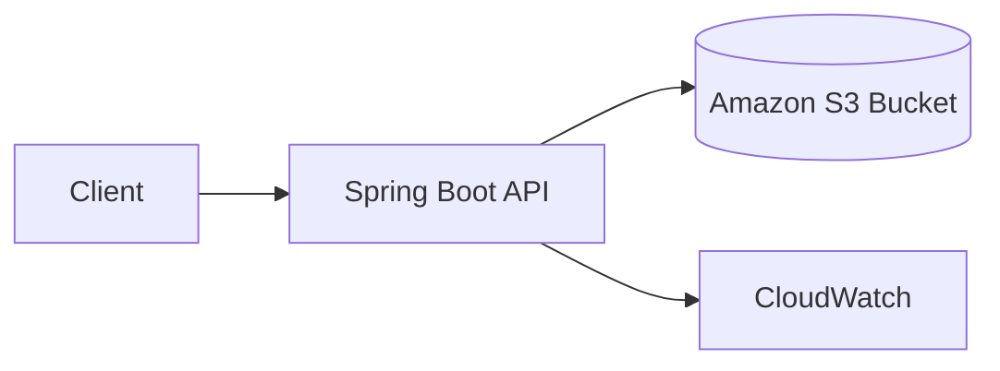

# Lab 3: Spring Boot + S3 File Upload

This lab shows how a Java application can upload files to Amazon S3, generate secure access links, and handle common file-storage requirements in a production-friendly way.

## What we are building

A Spring Boot API with endpoints to upload, list, and retrieve files from S3.

## Why this matters for Java developers

Java applications frequently need object storage for:

- files
- documents
- images
- backups
- generated reports

S3 is the default choice for durable, scalable, and secure file storage in AWS.

## AWS services used

- S3
- IAM
- CloudWatch
- optionally KMS for encryption

## Architecture



## Prerequisites

- AWS account
- AWS CLI configured
- Java 21+
- Maven
- S3 bucket permissions

## Project structure

```text
s3-file-upload/
├── README.md
├── app/
│   ├── pom.xml
│   └── src/
├── terraform/
│   └── main.tf
├── scripts/
│   ├── deploy.sh
│   └── destroy.sh
└── docker/
    └── Dockerfile
```

## Step-by-step implementation

### 1. Create an S3 bucket

Example bucket naming:

```bash
aws s3 mb s3://java-demo-uploads --region us-east-1
```

### 2. Add S3 dependency

```xml
<dependency>
    <groupId>software.amazon.awssdk</groupId>
    <artifactId>s3</artifactId>
</dependency>
```

### 3. Configure IAM access

Use a least-privilege role or IAM user policy that allows:

- `s3:PutObject`
- `s3:GetObject`
- `s3:DeleteObject`
- `s3:ListBucket`

### 4. Build the upload service

```java
@Service
public class S3StorageService {

    private final S3Client s3Client;

    public S3StorageService(S3Client s3Client) {
        this.s3Client = s3Client;
    }

    public String upload(String key, byte[] content) {
        s3Client.putObject(PutObjectRequest.builder()
                        .bucket("java-demo-uploads")
                        .key(key)
                        .build(),
                RequestBody.fromBytes(content));
        return key;
    }
}
```

### 5. Expose endpoints

```java
@PostMapping("/upload")
public ResponseEntity<String> upload(@RequestParam("file") MultipartFile file) throws IOException {
    String key = file.getOriginalFilename();
    storageService.upload(key, file.getBytes());
    return ResponseEntity.ok("Uploaded: " + key);
}
```

## Testing

```bash
curl -F "file=@example.txt" http://localhost:8080/files/upload
```

## Security

- use bucket policies and IAM restrictions
- enable encryption at rest with SSE-S3 or KMS
- avoid exposing bucket-wide public access
- prefer pre-signed URLs for temporary downloads

## Monitoring

- S3 bucket metrics
- access logs
- API gateway or app-level logs if a proxy is used

## Cost considerations

- use object lifecycle rules
- store only necessary files
- delete test objects after use

## Production improvements

- presigned URL generation
- multipart upload for large files
- KMS encryption
- CDN delivery for static content
- lifecycle policies and versioning

## Common mistakes

- making buckets public accidentally
- storing long-lived secrets in code
- uploading without size validation
- ignoring lifecycle and retention policies

## Cleanup

```bash
aws s3 rb s3://java-demo-uploads --force
```

## Related labs

- Spring Boot + RDS PostgreSQL
- Spring Boot + SQS order processing
- Deploy Spring Boot on EC2
