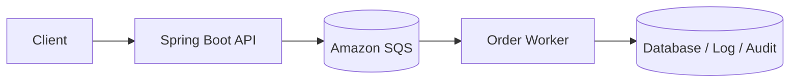

# Lab 4: Spring Boot + SQS Order Processing

This lab shows how to build an asynchronous, event-driven order-processing system using Amazon SQS.

## What we are building

A Spring Boot application that receives orders, sends them to an SQS queue, and processes them asynchronously using a consumer worker.

## Why this matters for Java developers

Asynchronous processing is a standard pattern in enterprise Java systems because it improves resilience, decouples services, and avoids request-time bottlenecks. This lab introduces:

- producer/consumer architecture
- message retries
- dead-letter queues
- idempotency concerns
- queue-based integration patterns

## AWS services used

- SQS
- IAM
- CloudWatch
- EC2 or ECS for deployment

## Architecture



## Prerequisites

- AWS account
- AWS CLI configured
- Java 21+
- Maven
- queue permissions for app role

## Project structure

```text
sqs-order-processing/
├── README.md
├── app/
│   ├── pom.xml
│   └── src/
├── terraform/
│   └── main.tf
├── scripts/
│   ├── deploy.sh
│   └── destroy.sh
└── docker/
    └── Dockerfile
```

## Step-by-step implementation

### 1. Create the queue

```bash
aws sqs create-queue --queue-name order-events
```

### 2. Add the AWS SDK dependency

```xml
<dependency>
    <groupId>software.amazon.awssdk</groupId>
    <artifactId>sqs</artifactId>
</dependency>
```

### 3. Create the order message model

```java
public record OrderMessage(Long orderId, String customerId, String status) {}
```

### 4. Send order messages from the API

```java
@Service
public class OrderProducer {
    private final SqsClient sqsClient;

    public OrderProducer(SqsClient sqsClient) {
        this.sqsClient = sqsClient;
    }

    public void sendOrder(Long orderId) {
        sqsClient.sendMessage(SendMessageRequest.builder()
                .queueUrl("https://sqs.us-east-1.amazonaws.com/123456789012/order-events")
                .messageBody("{\"orderId\":" + orderId + ",\"status\":\"created\"}")
                .build());
    }
}
```

### 5. Consume messages asynchronously

```java
@Component
public class OrderConsumer {

    @Scheduled(fixedDelay = 5000)
    public void pollQueue() {
        // receive from SQS and process messages
    }
}
```

## Testing

```bash
curl -X POST http://localhost:8080/orders -H "Content-Type: application/json" -d '{"orderId": 101, "status": "created"}'
```

## Security

- use least-privilege IAM roles
- avoid exposing raw queue URLs or credentials
- use DLQ for failed messages
- consider encryption at rest

## Monitoring

- queue depth metrics
- age of oldest message
- failed delivery counts
- application logs for retries and exceptions

## Cost considerations

- ensure queue retention and DLQ policies are sized appropriately
- delete SQS queues when the lab is complete
- avoid large message payloads for lab work

## Production improvements

- use dead-letter queues
- add idempotency checks
- add retries and backoff policies
- process with workers behind a queue worker pool
- integrate with EventBridge or Kafka for higher throughput

## Common mistakes

- not handling visibility timeout properly
- missing idempotency for duplicate messages
- processing without retries or DLQs
- ignoring message age and queue backlog spikes

## Cleanup

```bash
aws sqs delete-queue --queue-url https://sqs.us-east-1.amazonaws.com/<ACCOUNT_ID>/order-events
```

## Related labs

- Spring Boot + RDS PostgreSQL
- Spring Boot + S3 file upload
- Deploy Spring Boot on EC2
