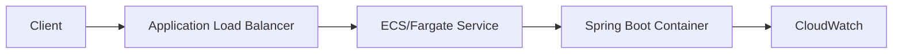

# Lab: Docker + ECS/Fargate for Spring Boot

This lab shows how to package the shared order-management-platform application in Docker and prepare it for an AWS ECS deployment.

## What we are building

A containerized Spring Boot API that is ready to be deployed in AWS Elastic Container Service (ECS) with Fargate.

## Why this matters for Java developers

Most production Java applications run in containers. ECS gives Java teams a straightforward path from a local container build to managed AWS deployment without the complexity of full Kubernetes setup.

## AWS services used

- Docker
- Amazon ECR
- ECS
- Fargate
- IAM
- CloudWatch

## Architecture



## Prerequisites

- Docker installed locally
- AWS CLI configured
- AWS ECR repository created
- Java 21 and Maven
- IAM permissions for ECR and ECS

## Project structure

```text
ecs-spring-boot/
├── README.md
├── docker/
│   └── Dockerfile
├── terraform/
│   └── main.tf
├── scripts/
│   ├── build-and-push.sh
│   ├── deploy.sh
│   └── destroy.sh
└── app/
    └── src/
```

## Step-by-step implementation

### 1. Build a Docker image

```dockerfile
FROM eclipse-temurin:21-jre
WORKDIR /app
COPY target/order-management-platform-0.0.1-SNAPSHOT.jar app.jar
EXPOSE 8080
ENTRYPOINT ["java", "-jar", "/app/app.jar"]
```

### 2. Build and push to ECR

```bash
aws ecr get-login-password --region us-east-1 | docker login --username AWS --password-stdin <ACCOUNT>.dkr.ecr.us-east-1.amazonaws.com

docker build -t order-management-platform .
docker tag order-management-platform:latest <ACCOUNT>.dkr.ecr.us-east-1.amazonaws.com/order-management-platform:latest
docker push <ACCOUNT>.dkr.ecr.us-east-1.amazonaws.com/order-management-platform:latest
```

### 3. Create an ECS cluster and task definition

Use ECS with:

- Fargate launch type
- one or more tasks
- a security group exposing port 8080 to the load balancer only
- CloudWatch logs

### 4. Expose with ALB

A production-friendly setup uses:

- Application Load Balancer
- target group with health check
- ECS service connected to ALB
- private subnets for the tasks if possible

## Testing

```bash
curl http://<ALB-DNS>/health
```

## Security

- add least-privilege IAM policies
- prefer private subnets
- use secrets or environment variables for configuration
- keep container images small

## Cost considerations

- choose the smallest Fargate tasks for labs
- set a budget alarm
- destroy the service after use

## Production improvements

- blue/green deployment
- autoscaling policies
- ALB path routing
- CloudWatch alarms and dashboards
- rollout with ECS service deployment circuits

## Common mistakes

- exposing a task directly without a load balancer
- leaving the ECS service running after the lab
- storing credentials in image layers
- ignoring health checks

## Cleanup

```bash
aws ecs update-service --cluster <cluster> --service <service> --desired-count 0
aws ecs delete-service --cluster <cluster> --service <service>
```

## Related labs

- EC2 + Spring Boot deployment
- Spring Boot + RDS PostgreSQL
- Spring Boot + SQS order processing
