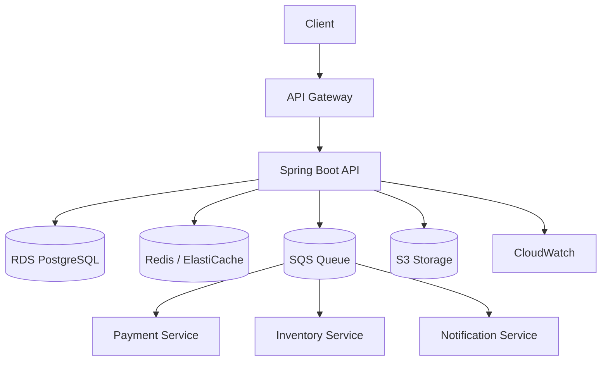

# AWS for Java Professionals

> Master AWS by building production-grade Java applications.

A hands-on, Java-first AWS learning repository designed for experienced backend engineers, senior Java developers, and Spring Boot professionals who want to build, deploy, secure, scale, and operate cloud-native applications on AWS.

## Why this repository exists

This repository is not another generic AWS tutorial. It is structured around the real questions Java engineers ask in production:

- How do I deploy a Spring Boot app on AWS?
- How do I connect Java to RDS, S3, SQS, Redis, and Kafka?
- How do I secure credentials, IAM roles, and network access?
- How do I run Java apps with Docker, ECS, and EKS?
- How do I debug latency, 504s, slow queries, and runaway cloud costs?
- How do I design resilient, observable, production-ready AWS architecture?

The learning path is:

Java → Spring Boot → AWS → Production Architecture → Cloud-Native System Design

---

## Repository positioning

This repository answers:

"I know Java and Spring Boot. How do I build, deploy, secure, scale, monitor, and operate Java applications on AWS?"

The content is organized around real Java engineering problems, not service-by-service AWS theory.

## Learning index

The repository is designed as one continuous journey. Start here, then move through the labs in order.

- [00-getting-started/README.md](00-getting-started/README.md) — AWS setup and account basics
- [01-aws-fundamentals/README.md](01-aws-fundamentals/README.md) — core AWS primitives
- [02-java-on-aws/spring-boot-ec2/README.md](02-java-on-aws/spring-boot-ec2/README.md) — deploy Spring Boot to EC2
- [03-databases/rds-postgresql/README.md](03-databases/rds-postgresql/README.md) — PostgreSQL on Amazon RDS
- [04-storage/s3-file-upload/README.md](04-storage/s3-file-upload/README.md) — S3 file upload patterns
- [05-messaging/sqs-order-processing/README.md](05-messaging/sqs-order-processing/README.md) — SQS-driven order processing
- [06-containers/README.md](06-containers/README.md) — Docker and ECS fundamentals
- [06-containers/ecs-spring-boot/README.md](06-containers/ecs-spring-boot/README.md) — Spring Boot container deployment on ECS/Fargate
- [07-serverless/README.md](07-serverless/README.md) — Lambda and API Gateway patterns
- [08-security-observability/README.md](08-security-observability/README.md) — security and operations
- [09-cicd-iac/README.md](09-cicd-iac/README.md) — Terraform and GitHub Actions
- [10-production-architecture/README.md](10-production-architecture/README.md) — production design patterns
- [11-system-design/README.md](11-system-design/README.md) — cloud architecture case studies
- [12-interview-prep/README.md](12-interview-prep/README.md) — AWS and Java scenario prep
- [projects/order-management-platform/README.md](projects/order-management-platform/README.md) — shared companion project across labs
- [docs/lab-index.md](docs/lab-index.md) — full topic map and next-step roadmap

---

## Target audience

- Java developers with 3+ years of experience
- Spring Boot engineers moving to cloud-native systems
- Backend engineers preparing for AWS architecture interviews
- Senior developers designing production systems on AWS
- Engineers who want a practical, code-first path into AWS

---

## Learning outcomes

By the end of the journey, learners should be able to:

- deploy Spring Boot applications on AWS using EC2, ECS, and EKS
- use RDS, DynamoDB, S3, Redis, SQS, SNS, EventBridge, and Kafka effectively
- secure AWS resources with IAM, KMS, Secrets Manager, and private networking
- design resilient cloud-native systems and production-ready architecture
- instrument Java apps with logs, metrics, tracing, and alerts
- troubleshoot slow APIs, outages, and cost spikes
- prepare for senior-level AWS system design and interview scenarios

---

## Repository structure

```text
aws-for-java-professionals/
├── README.md
├── LICENSE
├── CONTRIBUTING.md
├── ROADMAP.md
├── .gitignore
├── 00-getting-started/
│   ├── README.md
│   ├── aws-account-setup/
│   ├── aws-cli/
│   ├── aws-console/
│   ├── iam-basics/
│   └── cost-control/
├── 01-aws-fundamentals/
│   ├── README.md
│   ├── regions-and-az/
│   ├── iam/
│   ├── ec2/
│   ├── s3/
│   ├── vpc/
│   ├── security-groups/
│   └── cloudwatch/
├── 02-java-on-aws/
│   ├── README.md
│   ├── spring-boot-ec2/
│   ├── spring-boot-s3/
│   ├── spring-boot-secrets/
│   ├── spring-boot-cloudwatch/
│   └── spring-boot-parameter-store/
├── 03-databases/
│   ├── README.md
│   ├── rds-postgresql/
│   ├── aurora/
│   ├── dynamodb/
│   ├── elasticache/
│   └── database-migrations/
├── 04-storage/
│   ├── README.md
│   ├── s3/
│   ├── presigned-url/
│   ├── multipart-upload/
│   └── static-content/
├── 05-messaging/
│   ├── README.md
│   ├── sqs/
│   ├── sns/
│   ├── eventbridge/
│   ├── kafka/
│   └── spring-cloud-stream/
├── 06-containers/
│   ├── README.md
│   ├── docker/
│   ├── ecr/
│   ├── ecs/
│   ├── fargate/
│   └── ecs-spring-boot/
├── 07-serverless/
│   ├── README.md
│   ├── lambda/
│   ├── lambda-spring/
│   ├── api-gateway/
│   └── event-driven-architecture/
├── 08-security-observability/
│   ├── README.md
│   ├── iam-least-privilege/
│   ├── kms-secrets/
│   ├── cloudwatch-logs/
│   ├── open-telemetry/
│   └── alerting/
├── 09-cicd-iac/
│   ├── README.md
│   ├── terraform/
│   ├── cdk/
│   ├── github-actions/
│   └── deployment-pipelines/
├── 10-production-architecture/
│   ├── README.md
│   ├── multi-az/
│   ├── auto-scaling/
│   ├── load-balancers/
│   ├── resilience-patterns/
│   └── performance-tuning/
├── 11-system-design/
│   ├── README.md
│   ├── url-shortener/
│   ├── file-upload-service/
│   ├── order-management/
│   ├── payment-platform/
│   └── ride-booking/
├── 12-interview-prep/
│   ├── README.md
│   ├── scenario-questions/
│   ├── aws-java-debugging/
│   ├── system-design-cases/
│   └── mock-interviews/
├── projects/
│   ├── order-management-platform/
│   ├── event-driven-order-platform/
│   ├── cloud-native-microservices/
│   └── production-payment-platform/
├── docs/
│   ├── architecture-diagrams/
│   ├── cheat-sheets/
│   └── production-vs-tutorial.md
└── scripts/
    ├── deploy.sh
    ├── destroy.sh
    └── setup-env.sh
```

---

## Core learning model

Every tutorial in this repository follows the same structure:

```text
README.md
architecture.md
src/
docker/
terraform/
scripts/
tests/
```

Each lab includes:

1. What are we building?
2. Why this matters for Java developers
3. AWS services used
4. Architecture diagram
5. Prerequisites
6. Project structure
7. Step-by-step implementation
8. Java and Spring Boot code
9. AWS configuration
10. Deployment steps
11. Testing
12. Monitoring and logs
13. Security considerations
14. Cost considerations
15. Common mistakes
16. Production improvements
17. Interview questions
18. Cleanup instructions

This keeps the repository aligned with real engineering work instead of tutorial-style one-offs.

---

## Recommended technology stack

| Layer | Technology |
| --- | --- |
| Language | Java 21+ |
| Framework | Spring Boot |
| Build Tool | Maven |
| API Style | REST + OpenAPI |
| Database | PostgreSQL / Aurora |
| NoSQL | DynamoDB |
| Cache | Redis / ElastiCache |
| Messaging | SQS, SNS, EventBridge, Kafka |
| Containers | Docker |
| Container Registry | ECR |
| Compute | EC2, ECS, Fargate, Lambda |
| Orchestration | EKS |
| Storage | S3 |
| Security | IAM, KMS, Secrets Manager |
| Monitoring | CloudWatch, OpenTelemetry |
| IaC | Terraform, CDK |
| CI/CD | GitHub Actions |
| Testing | JUnit, Testcontainers |

---

## Learning path

```text
LEVEL 1  AWS Fundamentals
   ↓
LEVEL 2  Deploy Spring Boot
   ↓
LEVEL 3  AWS Databases & Storage
   ↓
LEVEL 4  Messaging & Event-Driven Systems
   ↓
LEVEL 5  Containers
   ↓
LEVEL 6  Serverless
   ↓
LEVEL 7  Security
   ↓
LEVEL 8  CI/CD + IaC
   ↓
LEVEL 9  Observability & Performance
   ↓
LEVEL 10 Production Architecture
   ↓
LEVEL 11 System Design
   ↓
LEVEL 12 AWS Interview Preparation
```

---

## Flagship application

The repository uses one realistic application across different labs:

### order-management-platform



This app is then deployed using different AWS architectures:

- EC2
- ECS/Fargate
- Lambda + API Gateway
- EKS
- Event-driven microservices
- Production-style multi-tier architecture

---

## Most valuable tutorial sequence

### Phase 1: Deploy Java on AWS

- Deploy a Spring Boot app on EC2
- Spring Boot + RDS PostgreSQL
- Spring Boot + S3 file storage
- Spring Boot + SQS asynchronous processing

### Phase 2: Move to microservices

- Order service
- Payment service
- Inventory service
- Notification service
- User service

### Phase 3: Production engineering

- multi-AZ and auto-scaling
- load balancers and health checks
- retries and idempotency
- Redis and connection pooling
- JVM tuning and virtual threads
- observability and alerts

### Phase 4: System design and interviews

- URL shortener
- file upload platform
- order management platform
- payment platform
- ride booking and healthcare architecture

---

## Production vs tutorial distinction

This is important for professionals.

```text
Tutorial: EC2 + public IP
Production: ALB + private subnet + Auto Scaling
```

```text
Tutorial: local AWS credentials
Production: IAM role / OIDC / workload identity
```

```text
Tutorial: single RDS instance
Production: multi-AZ + backups + monitoring + failover
```

This repository explicitly teaches the gap between learning labs and production architecture.

---

## Cost protection and AWS safety

Every lab should include a cost warning:

```text
⚠️ AWS COST WARNING
This tutorial creates AWS resources.
After completing the lab, run:

./scripts/destroy.sh
```

Students should always clean up resources to avoid surprise billing.

---

## Lab standards

Every lab is expected to follow this pattern:

```text
README.md
architecture.md
src/
docker/
terraform/
scripts/
tests/
```

A typical lab README should answer:

- What are we building?
- Why does this matter for Java developers?
- Which AWS services are used?
- What is the architecture?
- What are the prerequisites?
- Where is the code?
- How do we deploy?
- How do we test?
- How do we monitor and secure it?
- How do we clean up?

---

## Senior-level AWS troubleshooting topics

The repository also includes senior engineering problem-solving content such as:

- Why is my Spring Boot application slow on AWS?
- Why is my API returning 504?
- Why did my AWS bill suddenly increase?
- Why is JVM GC causing latency spikes?
- How do I debug database connection saturation?
- How do I prevent duplicate payments in distributed systems?

These are the kinds of issues that matter in real production work.

---

## Interview preparation style

Instead of memorizing AWS definitions, the repo emphasizes scenario-based questions:

> Your Spring Boot application receives 5,000 requests/second. CPU is 40%, but latency is increasing. How would you investigate?

> A payment API deployed on ECS succeeds but the client times out. How would you design a system to prevent duplicate payments?

These questions combine:

- Java and Spring Boot
- distributed systems
- AWS services
- observability
- security
- idempotency and retries
- production architecture

---

## Roadmap

See [ROADMAP.md](ROADMAP.md) for the complete planned learning progression.

---

## Contribution guide

See [CONTRIBUTING.md](CONTRIBUTING.md) for contribution standards, lab format, and review expectations.

---

## License

This project is licensed under the MIT License. See [LICENSE](LICENSE).

---

## Repository tagline

AWS for Java Professionals — Production-grade Spring Boot applications, cloud architecture, DevOps, security, observability, and system design.

---

## Suggested next step

Start with these labs in order:

1. AWS account setup and IAM basics
2. EC2 + Spring Boot deployment
3. Spring Boot + RDS PostgreSQL
4. Spring Boot + S3 storage
5. Spring Boot + SQS messaging
6. Docker + ECS/Fargate deployment
7. Observability and CloudWatch
8. Terraform-based infrastructure
9. Multi-service event-driven architecture
10. System design and interview preparation

This repository is designed to evolve from practical AWS bootcamp content into a serious Java cloud engineering handbook.
