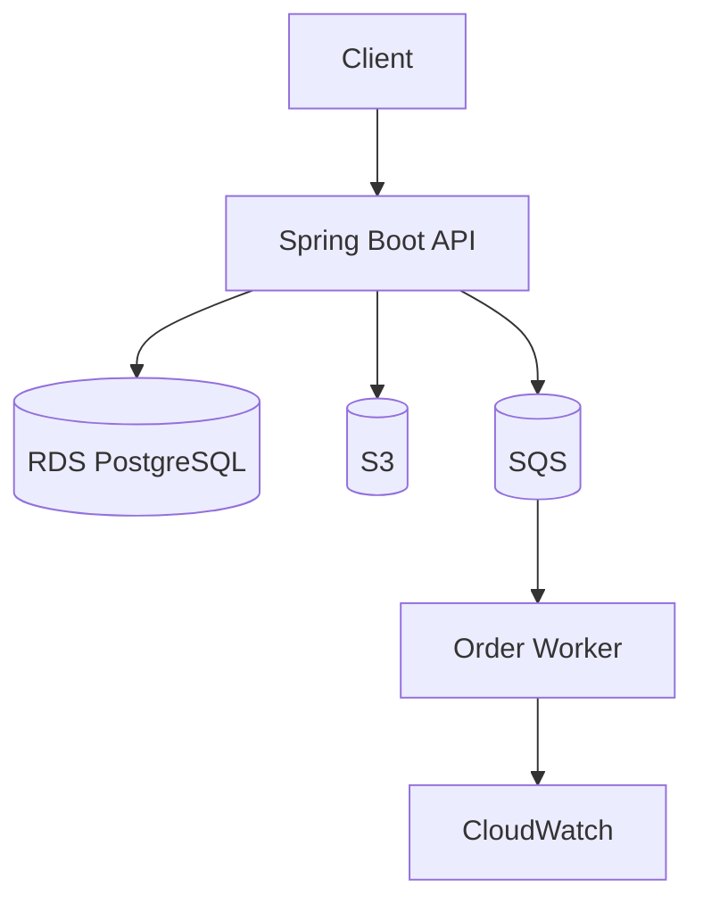

# Order Management Platform

This is the shared flagship application for the repository. It evolves across the AWS learning labs so learners see a single business domain transformed by different cloud patterns.

## Business domain

The platform manages customer orders, supports document attachments, stores order state, and processes order events asynchronously.

## Core capabilities

- create and read orders
- persist order data in PostgreSQL
- store order files in S3
- enqueue order events in SQS
- expose health and status endpoints
- run locally and in containerized AWS deployments

## Architectural goal

Start with a simple API running on EC2 and evolve it into a modern event-driven application architecture using AWS services.

## Suggested component flow



## Module layout

```text
order-management-platform/
├── README.md
├── app/
│   ├── pom.xml
│   └── src/
├── docker/
│   └── Dockerfile
├── terraform/
│   └── main.tf
├── scripts/
│   ├── deploy.sh
│   └── destroy.sh
└── docs/
    └── architecture.md
```

## Starting point for labs

This project forms the common base for:

- EC2 deployment lab
- RDS integration lab
- S3 upload lab
- SQS order processing lab
- Docker/ECS deployment lab

## Example API surface

- `POST /orders`
- `GET /orders/{id}`
- `GET /orders`
- `POST /orders/{id}/files`
- `GET /health`

## Production evolution

The same app should later evolve into:

- multi-tier, load-balanced deployment
- private networking with VPC and subnets
- autoscaling and health checks
- Kafka/EventBridge integration for higher complexity
- observability with CloudWatch, tracing, and alerts
