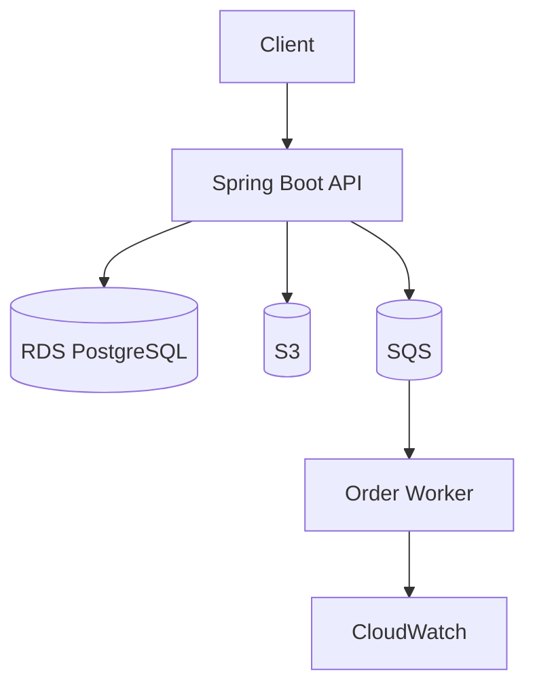
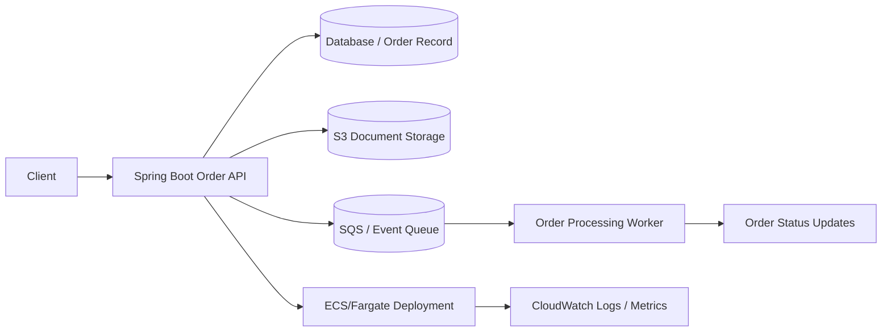

# Order Management Platform

This is the shared flagship application for the repository. It evolves across the AWS learning labs so learners see a single business domain transformed by different cloud patterns.

## Business domain

The platform manages customer orders, supports document attachments, stores order state, and processes order events asynchronously.

## Core capabilities

- create and read orders
- persist order data in PostgreSQL
- store order files in S3
- enqueue order events in SQS
- expose health and status endpoints
- run locally and in containerized AWS deployments

## Architectural goal

Start with a simple API running on EC2 and evolve it into a modern event-driven application architecture using AWS services.

## Suggested component flow



## Module layout

```text
order-management-platform/
├── README.md
├── app/
│   ├── pom.xml
│   └── src/
├── docker/
│   └── Dockerfile
├── terraform/
│   └── main.tf
├── scripts/
│   ├── deploy.sh
│   └── destroy.sh
└── docs/
    └── architecture.md
```

## Starting point for labs

This project forms the common base for:

- EC2 deployment lab
- RDS integration lab
- S3 upload lab
- SQS order processing lab
- Docker/ECS deployment lab

## Example API surface

- `POST /orders` — create a new order and emit an order-created event
- `GET /orders/{id}` — retrieve order details
- `GET /orders` — list order records
- `PUT /orders/{id}/status` — move order through the lifecycle
- `POST /orders/{id}/documents` — attach an order document, representing S3 upload flow
- `GET /health` — runtime health endpoint

## End-to-end order lifecycle

The full order lifecycle for this repository looks like this:

1. A customer creates an order through the Spring Boot API.
2. The app persists the order in the database and records a created status.
3. The order service emits a business event such as `OrderCreated` for downstream processing.
4. An order document can be uploaded and associated with the order, modeling the S3 storage path.
5. A worker or downstream service consumes the event and processes state changes like billing, shipping, or fulfillment.
6. The same app is then deployed in a containerized ECS environment behind an ALB for production-style operations.



## Production evolution

The same app should later evolve into:

- multi-tier, load-balanced deployment with ALB and ECS/Fargate
- secure S3 document storage with bucket policies and object lifecycle rules
- SQS and DLQ patterns for asynchronous order processing
- private networking with VPC and subnets
- autoscaling and health checks
- Kafka/EventBridge integration for higher complexity
- observability with CloudWatch, tracing, and alerts
